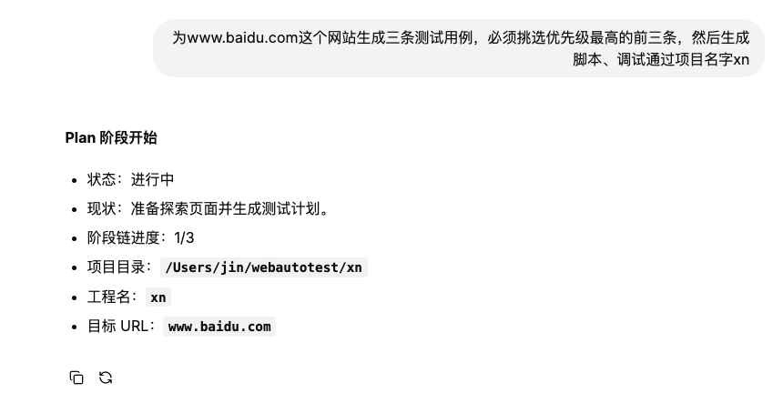
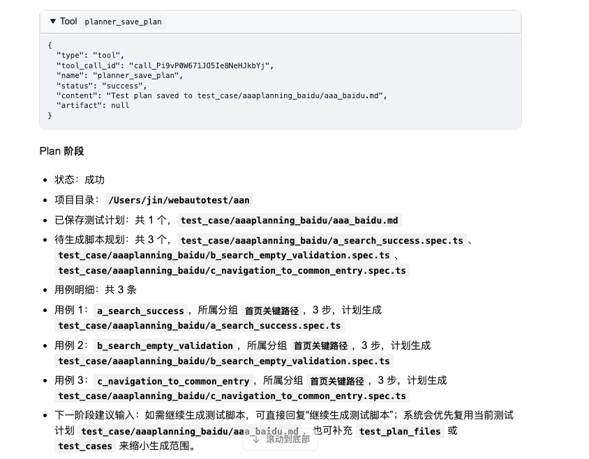
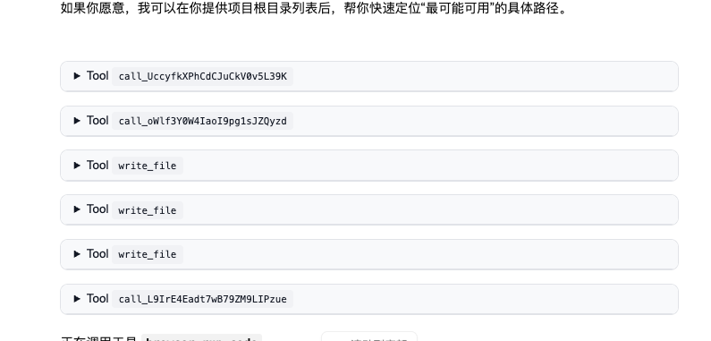
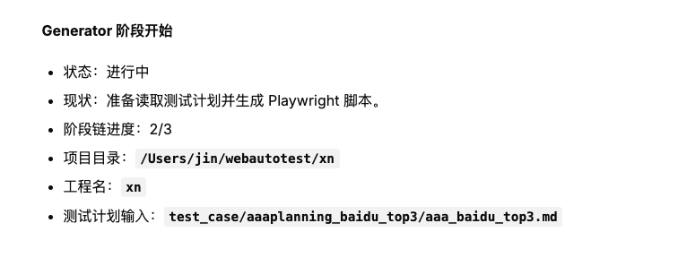
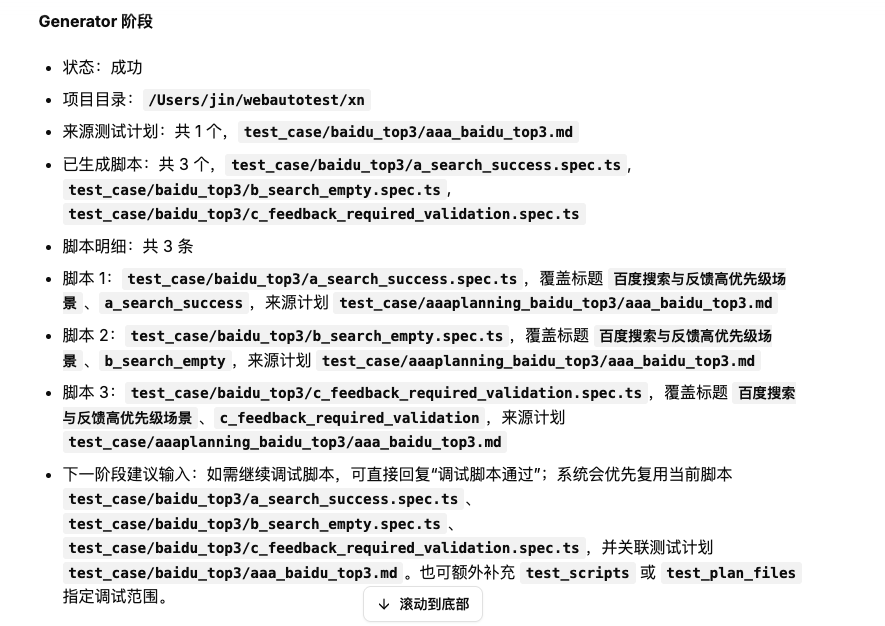
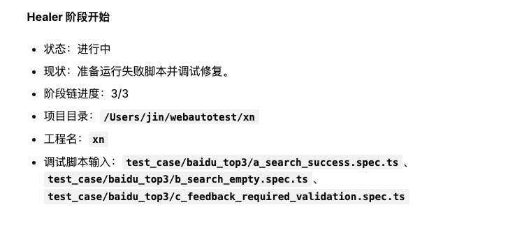
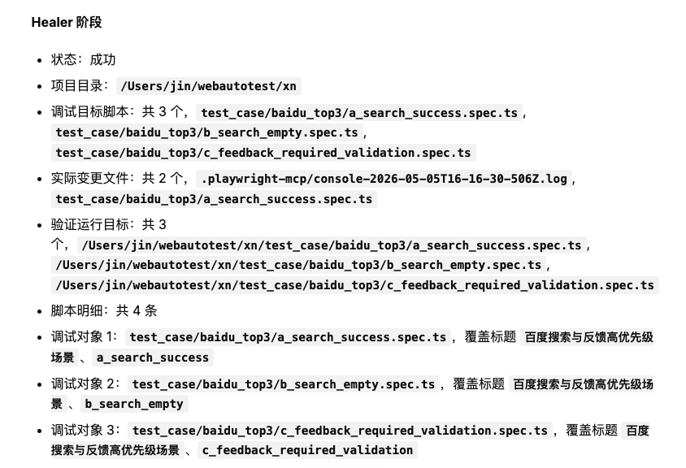
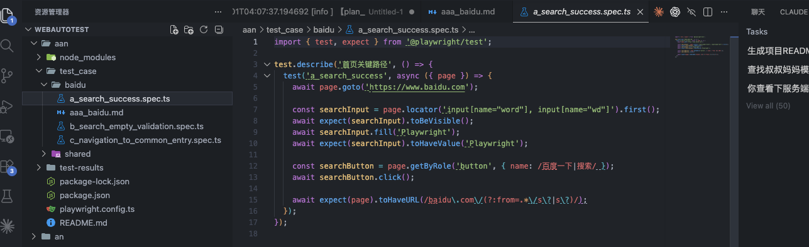
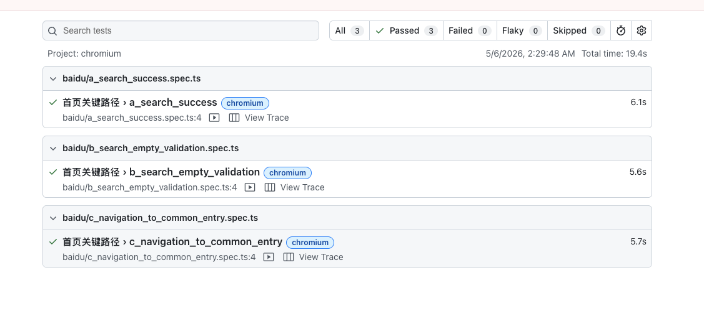
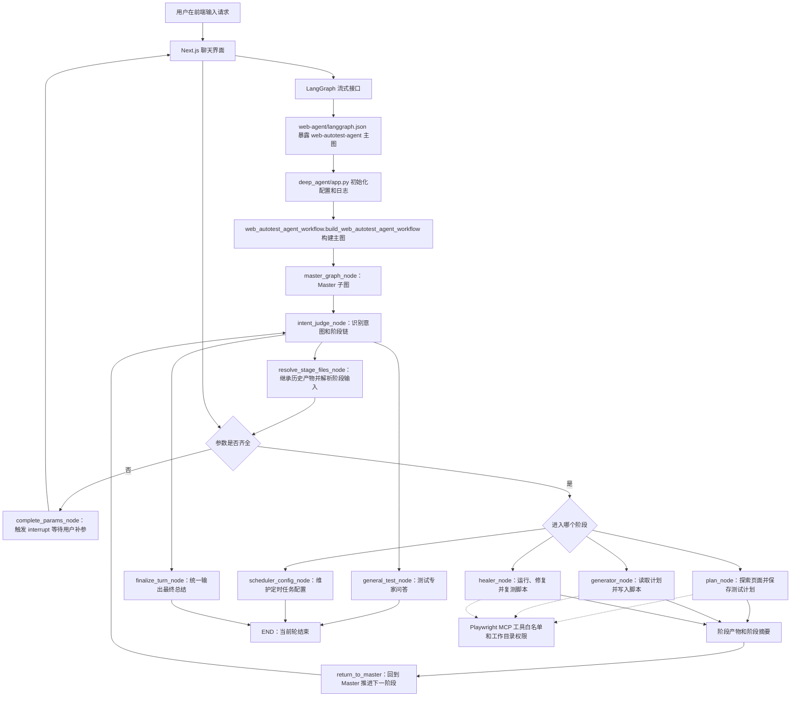

# Web AutoTest Agent 工程说明

## 1. 项目介绍

本项目是一个面向 Web 自动化测试的智能体工程，整体目标是把"理解测试需求、生成测试计划、生成 Playwright 脚本、调试修复失败脚本、定时执行测试"串成可持续使用的闭环。

从整体看，项目由三层组成：

1. 后端智能体层：位于 `web-agent/`，使用 LangGraph 编排主图，通过 Master 子图统一判断意图、补齐参数、分发到具体阶段。
2. 前端交互层：位于 `web-portal/`，基于 Next.js 和 Agent Chat UI，负责对话、历史线程、文件上传、人工中断补参、工具结果展示。
3. 本地运行与测试层：位于 `start/`、`web-agent/tests/` 和内置 demo 工程，负责一键拉起前后端、验证路由、验证阶段执行和调度服务。

分模块看，后端围绕一个 Master 和四类执行目标组织：

- `master`：统一入口，负责识别用户意图、抽取参数、处理普通问答、决定下一跳。
- `plan`：探索页面并保存 Markdown 测试计划。
- `generator`：读取测试计划并生成 Playwright `.spec.ts` 脚本。
- `healer`：运行失败脚本、定位问题、修改脚本并复测。
- `scheduler`：维护定时任务配置，并可由独立服务按 Cron 扫描执行。

## 2. 执行 Demo 示例

下面以一个完整请求走完 Plan、Generator、Healer 三个阶段，演示 Agent 从接到需求到调试通过的闭环。

示例输入：

> 为 www.baidu.com 这个网站生成三条测试用例，必须挑选优先级最高的前三条，然后生成脚本、调试通过，项目名字 xn

对应的三个阶段分别产出「测试计划 Markdown」「Playwright `.spec.ts` 脚本」「调试通过的脚本与测试报告」，整体流程与第 4 节运行架构图中的 Plan、Generator、Healer 一一对应。

### 2.1 Plan 阶段：探索页面并保存测试计划

Master 识别意图后进入 Plan 阶段，Agent 会探索目标站点，挑选优先级最高的前三条用例并落盘为 Markdown 测试计划。

<p align="center">
  <br />
  <em>① 接到用户请求，进入 Plan 阶段，确定工程名 `xn` 与目标 URL。</em>
</p>

<p align="center">
  <br />
  <em>② Plan 阶段按计划调用 Playwright MCP 工具探索页面，并多次 `write_file` 记录候选用例。</em>
</p>

<p align="center">
  <br />
  <em>③ `planner_save_plan` 将测试计划写入 `test_case/aaaplanning_baidu/aaa_baidu.md`，并规划出 3 条待生成的 `.spec.ts` 脚本。</em>
</p>

### 2.2 Generator 阶段：读取计划并生成 Playwright 脚本

Plan 阶段完成后，阶段链推进到 Generator。Agent 读取上一阶段落盘的测试计划，逐条生成 Playwright 脚本并写入目标工程目录。

<p align="center">
  <br />
  <em>④ Generator 阶段启动，进度 2/3，测试计划输入来自 Plan 阶段的产物。</em>
</p>

<p align="center">
  <br />
  <em>⑤ 生成 3 个 `.spec.ts` 脚本，并给出进入下一阶段的提示（直接回复"调试脚本通过"即可进入 Healer）。</em>
</p>

### 2.3 Healer 阶段：运行、修复并复测脚本

最后进入 Healer，Agent 会运行刚生成的脚本，命中失败时定位问题、修改脚本并复测，直到所有脚本全部通过。

<p align="center">
  <br />
  <em>⑥ Healer 阶段启动，进度 3/3，输入为 Generator 阶段生成的 3 个脚本。</em>
</p>

<p align="center">
  <br />
  <em>⑦ Healer 完成：变更文件落盘，验证运行目标覆盖全部 3 个脚本。</em>
</p>

<p align="center">
  <br />
  <em>⑧ Playwright 测试报告：3 条用例全部通过，总耗时约 19 秒。</em>
</p>

<p align="center">
  <br />
  <em>⑨ 目标工程 `webautotest/xn` 下的 `test_case/baidu/` 目录，生成的 `.spec.ts` 脚本可直接在本地 Playwright 中运行。</em>
</p>

## 3. 目录结构

说明：本节重点展开服务端目录、核心类和入口函数。`web-portal/` 前端子工程不再逐文件展开；后端本地缓存、运行日志、运行时数据、测试缓存、虚拟环境和构建产物也不在这里说明。

```text
web-test-agent/  # 仓库根目录。
├── README.md  # 当前工程说明文档。
├── DEVELOPMENT_GUIDE.md  # 开发规范和协作约束。
├── doc/  # 说明文档与示例资源。
│   ├── PRD-当前实现需求总结.md  # 当前版本需求与能力边界说明。
│   └── images/demo/  # 第 2 节「执行 Demo 示例」使用的截图资源。
├── .github/  # GitHub 自动化配置。
│   └── workflows/
│       └── ci.yml  # 持续集成流程。
├── start/  # 启动根目录，平台脚本直接放在这里。
│   ├── README.md
│   ├── macos-start.command  # macOS 启动脚本，支持 start / end / logs 参数。
│   └── windows-start.ps1   # Windows 启动入口（PowerShell 实现），支持 start / end / logs 参数。
├── web-agent/  # 后端智能体工程。
│   ├── pyproject.toml  # Python 包配置与命令入口。
│   ├── uv.lock  # Python 依赖锁文件。
│   ├── langgraph.json  # LangGraph 主图入口配置。
│   ├── scheduler_tasks.example.json  # 定时任务配置示例。
│   ├── deep_agent/  # 后端核心源码包。
│   │   ├── app.py  # LangGraph 加载入口，导出 `agent_graph`。
│   │   ├── web_autotest_agent_workflow.py  # 主工作流定义，提供 `build_web_autotest_agent_workflow()`。
│   │   ├── agent/  # Master、Plan、Generator、Healer、Scheduler 等智能体实现。
│   │   │   ├── state.py  # `WorkflowState`，统一承载消息、意图、参数、阶段链和产物。
│   │   │   ├── base_agent.py  # `BaseAgent` 与 `BaseSpecialistAgent`，定义节点执行契约和 Specialist 公共骨架。
│   │   │   ├── artifacts.py  # 阶段产物、工作区快照、阶段摘要等公共导出。
│   │   │   ├── specialist_helpers/  # Specialist 公共辅助能力。
│   │   │   │   ├── types.py  # `SpecialistRuntimeConfig` 与 `SpecialistExecutionContext`。
│   │   │   │   ├── workspace.py  # `SpecialistWorkspaceMixin`，处理项目目录和文件权限。
│   │   │   │   ├── display.py  # `SpecialistDisplayMixin`，处理阶段展示消息和总结。
│   │   │   │   ├── logging.py  # `SpecialistLoggingMixin`，处理事件日志和异常截断。
│   │   │   │   ├── input_resolution.py  # Specialist 输入归一化与 workspace 边界校验（通用入口）。
│   │   │   │   └── browser_close.py  # 统一识别 Playwright 浏览器关闭后的预期异常。
│   │   │   ├── master/  # Master 子图与共享服务。
│   │   │   │   ├── master_graph.py  # `build_master_graph()`，构建 Master 子图。
│   │   │   │   ├── master_agent.py  # `MasterAgent`，负责意图识别、补参、问答和最终总结。
│   │   │   │   ├── models/
│   │   │   │   │   └── intent.py  # `IntentClassification` 与参数抽取、缺参计算、阶段链推断。
│   │   │   │   └── nodes/
│   │   │   │       ├── intent_judge_node.py  # `IntentJudgeNode`，负责首次路由和阶段推进。
│   │   │   │       ├── resolve_stage_files_node.py  # `ResolveStageFilesNode`，继承历史产物并解析阶段文件。
│   │   │   │       ├── complete_params_node.py  # `CompleteParamsNode`，缺参中断与恢复。
│   │   │   │       ├── general_test_node.py  # `GeneralTestNode`,处理普通测试问答。
│   │   │   │       └── finalize_turn_node.py  # `FinalizeTurnNode`，合并当前轮摘要并输出最终结论。
│   │   │   ├── plan/
│   │   │   │   ├── plan_agent.py  # `PlanAgent`，阶段入口，只承担配置、参数校验、workspace、prompt、权限。
│   │   │   │   └── runtime.py  # `PlanRuntimeHelper`，承担事件流监听、`planner_save_plan` 状态机和产物抽取。
│   │   │   ├── generator/
│   │   │   │   ├── generator_agent.py  # `GeneratorAgent`，阶段入口，只承担配置、参数校验、workspace、prompt、权限。
│   │   │   │   └── runtime.py  # `GeneratorRuntimeHelper`，承担事件流监听、写文件状态机和脚本落盘校验。
│   │   │   ├── healer/
│   │   │   │   ├── healer_agent.py  # `HealerAgent`，阶段入口，只承担配置、参数校验、workspace、prompt、权限。
│   │   │   │   └── runtime.py  # `HealerRuntimeHelper`，承担事件流监听、验证范围采集和调试产物抽取。
│   │   │   └── scheduler/
│   │   │       └── scheduler_agent.py  # `SchedulerAgent`，把自然语言定时需求转成调度配置更新。
│   │   ├── config/  # 静态配置和文件过滤规则。
│   │   │   └── specialist_file_filter.py  # Specialist 文件查询范围和过滤规则。
│   │   ├── core/  # 基础设施、配置解析和显示消息逻辑。
│   │   │   ├── config.py  # `AppSettings` 与 `get_settings()`，集中管理环境变量和运行配置。
│   │   │   ├── autotest_project_directory.py  # 自动化工程目录解析与内置 demo 模板复制。
│   │   │   ├── cancellation.py  # LangGraph 用户取消信号识别。
│   │   │   ├── local_runtime_cleanup.py  # 本地 in-memory runtime 启动清理。
│   │   │   ├── runtime_logging.py  # 统一日志格式、状态摘要和敏感信息截断。
│   │   │   └── display_message/  # 用户可见消息提取、去重和汇总逻辑。
│   │   ├── scheduler/  # 独立定时执行服务。
│   │   │   ├── cli.py  # 定时服务命令行入口。
│   │   │   ├── cron.py  # `CronField` 与 `CronExpression`，解析和匹配 Cron 表达式。
│   │   │   ├── models.py  # `SchedulerRuntimeConfig` 等调度配置模型。
│   │   │   ├── service.py  # `PendingScheduledRun`、`ScheduledRunResult`、`PlaywrightTaskRunner`、`SchedulerService`。
│   │   │   └── store.py  # 调度配置文件读写与项目路径解析。
│   │   ├── tools/  # MCP 与 Playwright 工具接入。
│   │   │   ├── mcp_manager.py  # `MCPServerProvider`、`_CachedToolsSession`、`MCPToolsManager`（通用编排，无业务特例）。
│   │   │   ├── tool_error_handling.py  # `GenericMCPToolErrorPolicy`，统一工具错误包装。
│   │   │   ├── tool_invocation.py  # 工具输出判错、直接调用底层实现等通用辅助。
│   │   │   └── playwright/
│   │   │       ├── mcp_provider.py  # `PlaywrightTestMCPProvider`，连接参数与 `post_process_tool` 钩子。
│   │   │       ├── planner_save_plan_wrapper.py  # `planner_save_plan` 阶段专属规则包装（路径校验、缺父目录重建）。
│   │   │       ├── allowlists.py  # Plan / Generator / Healer 各自允许调用的工具白名单。
│   │   │       └── tool_error_policy.py  # `PlaywrightMCPToolErrorPolicy`，区分可重试和不可重试错误。
│   │   └── assets/  # 内置 demo 模板与资源文件。
│   └── tests/  # 后端自动化测试与调试脚本。
└── web-portal/  # 前端聊天界面工程，目录细节见子工程 README。
```

### 3.1 服务端核心类与职责

- 入口与状态：`AppSettings` 负责统一环境变量和运行配置，`WorkflowState` 负责统一 LangGraph 全局状态，`build_web_autotest_agent_workflow()` 负责组装整个服务端主图。
- Master 路由层：`MasterAgent`、`IntentClassification`、`IntentJudgeNode`、`ResolveStageFilesNode`、`CompleteParamsNode` 和 `FinalizeTurnNode` 共同完成意图识别、缺参补全、阶段切换和最终回复汇总。
- Specialist 执行层：`BaseAgent` 定义统一执行接口，`BaseSpecialistAgent` 负责 Plan、Generator、Healer 三类阶段的公共执行骨架；`SpecialistRuntimeConfig`、`SpecialistExecutionContext` 和三个 `Mixin`（workspace、display、logging）负责运行时配置、目录权限、消息展示和日志处理。
- Specialist 分层约定：`*_agent.py` 只承担"阶段配置 + 参数校验 + workspace 解析 + prompt + 写权限"这类静态职责；事件流监听、工具状态机、产物抽取等运行期逻辑放在同目录下的 `runtime.py`（`PlanRuntimeHelper` / `GeneratorRuntimeHelper` / `HealerRuntimeHelper`）里，分层方式与 Master 的 `master_agent.py + master_graph.py + nodes/*.py` 保持一致。
- 通用输入与异常识别：Specialist 规范化的输入解析、workspace 边界校验、浏览器关闭预期异常识别等能力统一放在 `agent/specialist_helpers/` 下的 `input_resolution.py` 与 `browser_close.py`，不再在各阶段重复实现。
- 阶段智能体：`PlanAgent` 负责生成测试计划，`GeneratorAgent` 负责生成脚本，`HealerAgent` 负责修复失败脚本，`SchedulerAgent` 负责把自然语言定时需求转换为配置更新。
- 工具与调度层：`MCPToolsManager` 只做通用编排（会话复用、白名单解析、错误处理器补齐），`MCPServerProvider.post_process_tool` 钩子承担各 server 的业务规则，例如 Playwright 的 `planner_save_plan` 路径校验与缺父目录自动重建（见 `tools/playwright/planner_save_plan_wrapper.py`）；`SchedulerService`、`PlaywrightTaskRunner`、`PendingScheduledRun`、`ScheduledRunResult` 负责定时任务的扫描、排队和执行；`CronExpression` 与 `CronField` 负责 Cron 解析与命中判断。

## 4. 运行架构图



运行状态可以按一次用户请求理解为七步：

1. 初始化：`app.py` 读取环境变量、配置日志、调用 `build_web_autotest_agent_workflow()` 编译图。
2. 等待输入：前端通过 LangGraph 流式接口连接 `web-autotest-agent` 主图，等待用户提交消息。
3. Master 路由：`IntentJudgeNode` 调用 `MasterAgent` 判断请求属于计划、生成、修复、普通问答或定时任务。
4. 参数准备：`ResolveStageFilesNode` 继承历史产物，`CompleteParamsNode` 在缺参时中断并等待补充。
5. 阶段执行：Plan、Generator、Healer 通过 `BaseSpecialistAgent` 准备工作目录、加载提示词、获取 MCP 工具并执行 Deep Agent。
6. 产物回流：阶段完成后写入 `artifact_history`、`latest_artifacts` 和 `pending_stage_summaries`，多阶段链路继续回到 Master。
7. 汇总结束：`FinalizeTurnNode` 将当前轮所有阶段摘要合成用户可见结论，随后进入下一轮等待。
