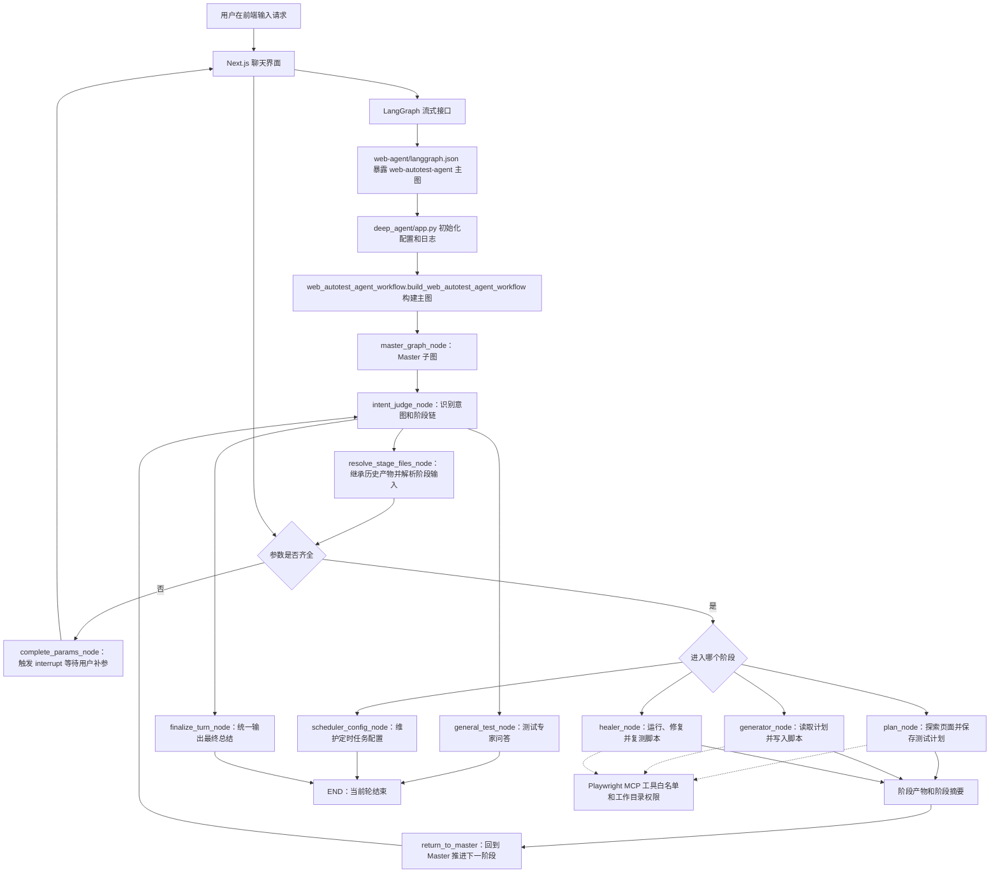

# Web AutoTest Agent 工程说明

## 1. 项目介绍

本项目是一个面向 Web 自动化测试的智能体工程，整体目标是把“理解测试需求、生成测试计划、生成 Playwright 脚本、调试修复失败脚本、定时执行测试”串成可持续使用的闭环。

从整体看，项目由三层组成：

1. 后端智能体层：位于 `web-agent/`，使用 LangGraph 编排主图，通过 Master 子图统一判断意图、补齐参数、分发到具体阶段。
2. 前端交互层：位于 `web-portal/`，基于 Next.js 和 Agent Chat UI，负责对话、历史线程、文件上传、人工中断补参、工具结果展示。
3. 本地运行与测试层：位于 `start/`、`web-agent/tests/` 和内置 demo 工程，负责一键拉起前后端、验证路由、验证阶段执行和调度服务。

分模块看，后端围绕一个 Master 和四类执行目标组织：

- `master`：统一入口，负责识别用户意图、抽取参数、处理普通问答、决定下一跳。
- `plan`：探索页面并保存 Markdown 测试计划。
- `generator`：读取测试计划并生成 Playwright `.spec.ts` 脚本。
- `healer`：运行失败脚本、定位问题、修改脚本并复测。
- `scheduler`：维护定时任务配置，并可由独立服务按 Cron 扫描执行。

## 2. 目录结构

说明：本节重点展开服务端目录、核心类和入口函数。`web-portal/` 前端子工程不再逐文件展开；后端本地缓存、运行日志、运行时数据、测试缓存、虚拟环境和构建产物也不在这里说明。

```text
web-test-agent/  # 仓库根目录。
├── README.md  # 当前工程说明文档。
├── DEVELOPMENT_GUIDE.md  # 开发规范和协作约束。
├── PRD-当前实现需求总结.md  # 当前版本需求与能力边界说明。
├── RD-定时任务实现与调试说明.md  # 定时任务实现与调试补充文档。
├── .github/  # GitHub 自动化配置。
│   └── workflows/
│       └── ci.yml  # 持续集成流程。
├── start/  # 启动根目录，平台脚本直接放在这里。
│   ├── README.md
│   ├── macos-start.command  # macOS 启动脚本，支持 start / end / logs 参数。
│   └── windows-start.bat    # Windows 启动入口（单文件 polyglot 实现），支持 start / end / logs 参数。
├── web-agent/  # 后端智能体工程。
│   ├── pyproject.toml  # Python 包配置与命令入口。
│   ├── uv.lock  # Python 依赖锁文件。
│   ├── langgraph.json  # LangGraph 主图入口配置。
│   ├── scheduler_tasks.example.json  # 定时任务配置示例。
│   ├── deep_agent/  # 后端核心源码包。
│   │   ├── app.py  # LangGraph 加载入口，导出 `agent_graph`。
│   │   ├── web_autotest_agent_workflow.py  # 主工作流定义，提供 `build_web_autotest_agent_workflow()`。
│   │   ├── agent/  # Master、Plan、Generator、Healer、Scheduler 等智能体实现。
│   │   │   ├── state.py  # `WorkflowState`，统一承载消息、意图、参数、阶段链和产物。
│   │   │   ├── base_agent.py  # `BaseAgent` 与 `BaseSpecialistAgent`，定义节点执行契约和 Specialist 公共骨架。
│   │   │   ├── artifacts.py  # 阶段产物、工作区快照、阶段摘要等公共导出。
│   │   │   ├── specialist_helpers/  # Specialist 公共辅助能力。
│   │   │   │   ├── types.py  # `SpecialistRuntimeConfig` 与 `SpecialistExecutionContext`。
│   │   │   │   ├── workspace.py  # `SpecialistWorkspaceMixin`，处理项目目录和文件权限。
│   │   │   │   ├── display.py  # `SpecialistDisplayMixin`，处理阶段展示消息和总结。
│   │   │   │   ├── logging.py  # `SpecialistLoggingMixin`，处理事件日志和异常截断。
│   │   │   │   ├── input_resolution.py  # Specialist 输入归一化与 workspace 边界校验（通用入口）。
│   │   │   │   └── browser_close.py  # 统一识别 Playwright 浏览器关闭后的预期异常。
│   │   │   ├── master/  # Master 子图与共享服务。
│   │   │   │   ├── master_graph.py  # `build_master_graph()`，构建 Master 子图。
│   │   │   │   ├── master_agent.py  # `MasterAgent`，负责意图识别、补参、问答和最终总结。
│   │   │   │   ├── models/
│   │   │   │   │   └── intent.py  # `IntentClassification` 与参数抽取、缺参计算、阶段链推断。
│   │   │   │   └── nodes/
│   │   │   │       ├── intent_judge_node.py  # `IntentJudgeNode`，负责首次路由和阶段推进。
│   │   │   │       ├── resolve_stage_files_node.py  # `ResolveStageFilesNode`，继承历史产物并解析阶段文件。
│   │   │   │       ├── complete_params_node.py  # `CompleteParamsNode`，缺参中断与恢复。
│   │   │   │       ├── general_test_node.py  # `GeneralTestNode`,处理普通测试问答。
│   │   │   │       └── finalize_turn_node.py  # `FinalizeTurnNode`，合并当前轮摘要并输出最终结论。
│   │   │   ├── plan/
│   │   │   │   ├── plan_agent.py  # `PlanAgent`，阶段入口，只承担配置、参数校验、workspace、prompt、权限。
│   │   │   │   └── runtime.py  # `PlanRuntimeHelper`，承担事件流监听、`planner_save_plan` 状态机和产物抽取。
│   │   │   ├── generator/
│   │   │   │   ├── generator_agent.py  # `GeneratorAgent`，阶段入口，只承担配置、参数校验、workspace、prompt、权限。
│   │   │   │   └── runtime.py  # `GeneratorRuntimeHelper`，承担事件流监听、写文件状态机和脚本落盘校验。
│   │   │   ├── healer/
│   │   │   │   ├── healer_agent.py  # `HealerAgent`，阶段入口，只承担配置、参数校验、workspace、prompt、权限。
│   │   │   │   └── runtime.py  # `HealerRuntimeHelper`，承担事件流监听、验证范围采集和调试产物抽取。
│   │   │   └── scheduler/
│   │   │       └── scheduler_agent.py  # `SchedulerAgent`，把自然语言定时需求转成调度配置更新。
│   │   ├── config/  # 静态配置和文件过滤规则。
│   │   │   └── specialist_file_filter.py  # Specialist 文件查询范围和过滤规则。
│   │   ├── core/  # 基础设施、配置解析和显示消息逻辑。
│   │   │   ├── config.py  # `AppSettings` 与 `get_settings()`，集中管理环境变量和运行配置。
│   │   │   ├── autotest_project_directory.py  # 自动化工程目录解析与内置 demo 模板复制。
│   │   │   ├── cancellation.py  # LangGraph 用户取消信号识别。
│   │   │   ├── local_runtime_cleanup.py  # 本地 in-memory runtime 启动清理。
│   │   │   ├── runtime_logging.py  # 统一日志格式、状态摘要和敏感信息截断。
│   │   │   └── display_message/  # 用户可见消息提取、去重和汇总逻辑。
│   │   ├── scheduler/  # 独立定时执行服务。
│   │   │   ├── cli.py  # 定时服务命令行入口。
│   │   │   ├── cron.py  # `CronField` 与 `CronExpression`，解析和匹配 Cron 表达式。
│   │   │   ├── models.py  # `SchedulerRuntimeConfig` 等调度配置模型。
│   │   │   ├── service.py  # `PendingScheduledRun`、`ScheduledRunResult`、`PlaywrightTaskRunner`、`SchedulerService`。
│   │   │   └── store.py  # 调度配置文件读写与项目路径解析。
│   │   ├── tools/  # MCP 与 Playwright 工具接入。
│   │   │   ├── mcp_manager.py  # `MCPServerProvider`、`_CachedToolsSession`、`MCPToolsManager`（通用编排，无业务特例）。
│   │   │   ├── tool_error_handling.py  # `GenericMCPToolErrorPolicy`，统一工具错误包装。
│   │   │   ├── tool_invocation.py  # 工具输出判错、直接调用底层实现等通用辅助。
│   │   │   └── playwright/
│   │   │       ├── mcp_provider.py  # `PlaywrightTestMCPProvider`，连接参数与 `post_process_tool` 钩子。
│   │   │       ├── planner_save_plan_wrapper.py  # `planner_save_plan` 阶段专属规则包装（路径校验、缺父目录重建）。
│   │   │       ├── allowlists.py  # Plan / Generator / Healer 各自允许调用的工具白名单。
│   │   │       └── tool_error_policy.py  # `PlaywrightMCPToolErrorPolicy`，区分可重试和不可重试错误。
│   │   └── assets/  # 内置 demo 模板与资源文件。
│   └── tests/  # 后端自动化测试与调试脚本。
└── web-portal/  # 前端聊天界面工程，目录细节见子工程 README。
```

### 2.1 服务端核心类与职责

- 入口与状态：`AppSettings` 负责统一环境变量和运行配置，`WorkflowState` 负责统一 LangGraph 全局状态，`build_web_autotest_agent_workflow()` 负责组装整个服务端主图。
- Master 路由层：`MasterAgent`、`IntentClassification`、`IntentJudgeNode`、`ResolveStageFilesNode`、`CompleteParamsNode` 和 `FinalizeTurnNode` 共同完成意图识别、缺参补全、阶段切换和最终回复汇总。
- Specialist 执行层：`BaseAgent` 定义统一执行接口，`BaseSpecialistAgent` 负责 Plan、Generator、Healer 三类阶段的公共执行骨架；`SpecialistRuntimeConfig`、`SpecialistExecutionContext` 和三个 `Mixin`（workspace、display、logging）负责运行时配置、目录权限、消息展示和日志处理。
- Specialist 分层约定：`*_agent.py` 只承担"阶段配置 + 参数校验 + workspace 解析 + prompt + 写权限"这类静态职责；事件流监听、工具状态机、产物抽取等运行期逻辑放在同目录下的 `runtime.py`（`PlanRuntimeHelper` / `GeneratorRuntimeHelper` / `HealerRuntimeHelper`）里，分层方式与 Master 的 `master_agent.py + master_graph.py + nodes/*.py` 保持一致。
- 通用输入与异常识别：Specialist 规范化的输入解析、workspace 边界校验、浏览器关闭预期异常识别等能力统一放在 `agent/specialist_helpers/` 下的 `input_resolution.py` 与 `browser_close.py`，不再在各阶段重复实现。
- 阶段智能体：`PlanAgent` 负责生成测试计划，`GeneratorAgent` 负责生成脚本，`HealerAgent` 负责修复失败脚本，`SchedulerAgent` 负责把自然语言定时需求转换为配置更新。
- 工具与调度层：`MCPToolsManager` 只做通用编排（会话复用、白名单解析、错误处理器补齐），`MCPServerProvider.post_process_tool` 钩子承担各 server 的业务规则，例如 Playwright 的 `planner_save_plan` 路径校验与缺父目录自动重建（见 `tools/playwright/planner_save_plan_wrapper.py`）；`SchedulerService`、`PlaywrightTaskRunner`、`PendingScheduledRun`、`ScheduledRunResult` 负责定时任务的扫描、排队和执行；`CronExpression` 与 `CronField` 负责 Cron 解析与命中判断。

## 3. 运行架构图



运行状态可以按一次用户请求理解为七步：

1. 初始化：`app.py` 读取环境变量、配置日志、调用 `build_web_autotest_agent_workflow()` 编译图。
2. 等待输入：前端通过 LangGraph 流式接口连接 `web-autotest-agent` 主图，等待用户提交消息。
3. Master 路由：`IntentJudgeNode` 调用 `MasterAgent` 判断请求属于计划、生成、修复、普通问答或定时任务。
4. 参数准备：`ResolveStageFilesNode` 继承历史产物，`CompleteParamsNode` 在缺参时中断并等待补充。
5. 阶段执行：Plan、Generator、Healer 通过 `BaseSpecialistAgent` 准备工作目录、加载提示词、获取 MCP 工具并执行 Deep Agent。
6. 产物回流：阶段完成后写入 `artifact_history`、`latest_artifacts` 和 `pending_stage_summaries`，多阶段链路继续回到 Master。
7. 汇总结束：`FinalizeTurnNode` 将当前轮所有阶段摘要合成用户可见结论，随后进入下一轮等待。

## 4. 开发与备注规范

- 新增或修改说明性备注、代码注释和 docstring 必须使用中文；技术名、类名、方法名、配置键、文件路径可以保留原文，但解释文字不得写成英文句子。
- 类与方法的备注必须说明三个重点：当前类或方法的作用是什么、主要由谁调用或消费、最终要达成什么目的。
- 文件命名不能只描述"它是什么"，还必须说明"它是谁的什么"；例如使用 `master_graph.py`、`web_autotest_agent_workflow.py` 这类带归属和职责边界的命名，避免 `graph.py`、`workflow.py` 这类缺少区分度的文件名。
- Specialist 分层约定：`*_agent.py` 只保留阶段配置、参数校验、workspace 解析、prompt 构建和写权限；事件流监听、工具状态机、产物抽取等运行期逻辑必须放在同目录的 `runtime.py`（对应 `PlanRuntimeHelper` / `GeneratorRuntimeHelper` / `HealerRuntimeHelper`）里，保持与 Master 子图相同的分层方式。
- MCP 工具业务规则：`MCPToolsManager` 只做通用编排，工具级规则（例如 Playwright 的 `planner_save_plan` 路径校验、缺父目录自动重建）必须通过 `MCPServerProvider.post_process_tool` 钩子在对应 provider 目录下实现，不允许写进 `mcp_manager.py`。
- Specialist 通用输入归一化、workspace 边界校验、浏览器关闭预期异常识别等能力必须复用 `agent/specialist_helpers/` 下的 `input_resolution.py` 与 `browser_close.py`，不允许在各 Specialist 中复制实现。
- 新增类、节点、Agent、工具、配置字段时，必须同步更新根目录 README、PRD 或开发规范中受影响的部分。
- Pydantic 字段必须写清楚 `description`，说明字段含义、使用场景和影响范围。
- 关键路径必须保留日志，至少覆盖配置加载、图构建、节点入参、节点出参、条件路由、MCP 连接、工具事件和阶段完成状态。
- 提示词文件默认视为业务资产；除非需求明确涉及提示词行为，不应顺手改动无关提示词。

## 5. 依赖环境与启动步骤

### 5.1 依赖环境

启动脚本不会自动下载或安装系统级工具，请在首次运行前自行准备以下环境：

- Git：版本 2.x 及以上。
  - macOS：`brew install git`，或访问 https://git-scm.com/download/mac
  - Windows：访问 https://git-scm.com/download/win，或 `winget install -e --id Git.Git`
- Node.js：要求 22 LTS 或更高版本。前端和 Playwright 相关能力都依赖它。
  - macOS：`brew install node@22`，或访问 https://nodejs.org/
  - Windows：访问 https://nodejs.org/，或 `winget install -e --id OpenJS.NodeJS.LTS`
- Python：要求 3.11 或更高版本。后端依赖通过 `uv` 调用。
  - macOS：`brew install python@3.11`，或访问 https://www.python.org/downloads/
  - Windows：访问 https://www.python.org/downloads/，或 `winget install -e --id Python.Python.3.11`（安装时务必勾选 “Add Python to PATH”）
- 包管理与工具：
  - 后端依赖通过 `uv` 管理。
    - macOS：`brew install uv`，或 `curl -LsSf https://astral.sh/uv/install.sh | sh`
    - Windows：`powershell -NoProfile -ExecutionPolicy Bypass -Command "irm https://astral.sh/uv/install.ps1 | iex"`，或 `winget install -e --id astral-sh.uv`
    - 更多方式见 https://docs.astral.sh/uv/getting-started/installation/
  - 前端依赖通过 `pnpm@10.5.1` 管理；推荐通过 Corepack 锁定版本：`corepack enable; corepack prepare pnpm@10.5.1 --activate`。
  - Playwright 浏览器依赖使用 `npx playwright install chromium` 安装，脚本会在首次启动时自动执行。

启动脚本会在每次运行前依次检查上述工具是否存在以及版本是否达标；如果有缺失或版本过低，脚本会输出明确的修复建议并直接退出，不会尝试自动安装。

- 模型服务配置：项目运行前需要准备 `web-agent/.env`，至少确认以下配置：
  - `OPENAI_API_KEY`
  - `OPENAI_BASE_URL`
  - `MASTER_MODEL`
  - `SPECIALIST_MODEL`
  - `DEFAULT_AUTOMATION_PROJECT_ROOT`
- 配置维护约束：`web-agent/.env` 是唯一配置源；新增配置先落到 `.env`，验证完成后再脱敏同步到 `.env.example`。

推荐先从模板复制环境文件：

```bash
cp web-agent/.env.example web-agent/.env
```

### 5.2 推荐启动方式

推荐直接运行 `start/` 目录下对应平台的脚本。首次启动时，脚本会自动处理以下内容：

- 检查 Git、Node.js、Python、uv、pnpm 是否存在且版本满足要求（不做自动安装，仅做检查与友好提示；如有缺失请按 5.1 节自行安装后重试）
- 同步后端依赖和前端依赖
- 安装 Playwright Chromium 浏览器
- 按阶段输出启动进度，并把依赖安装过程直接打印到当前终端

启动步骤如下：

1. 复制环境文件：

   ```bash
   cp web-agent/.env.example web-agent/.env
   ```

2. 打开 `web-agent/.env`，按你的模型服务补齐配置，例如：

   ```env
   OPENAI_API_KEY=
   OPENAI_BASE_URL=
   MASTER_MODEL=openai:gpt-4.1
   SPECIALIST_MODEL=openai:gpt-5.4
   DEFAULT_AUTOMATION_PROJECT_ROOT=~/webautotest
   PWTEST_HEADED=true
   ```

3. 按操作系统启动项目：

   - macOS：在终端里运行 `bash start/macos-start.command start`，也可直接在 Finder 里双击 `start/macos-start.command`。
   - Windows：在资源管理器里双击 `start\windows-start.bat`，或在命令行里运行 `start\windows-start.bat start`。

4. 启动成功后，默认会打开前端页面；默认地址通常为 `http://127.0.0.1:3000/?chatHistoryOpen=true`。后端默认监听 `http://127.0.0.1:2024`。

5. 如果需要排查启动问题：
   - 依赖安装和启动准备信息直接查看当前启动窗口输出。
   - 后端服务日志查看 `start/backend.log`。
   - 如果需要在新的终端窗口里持续查看后端日志：
     - macOS：`bash start/macos-start.command logs`
     - Windows：`start\windows-start.bat logs`

6. 如果需要在启动窗口之外手动关闭服务，可以使用：
   - macOS：`bash start/macos-start.command end`
   - Windows：`start\windows-start.bat end`

### 5.3 开发联调启动方式

如果你是开发者，或希望手动控制依赖安装过程，可以先手动准备环境，然后仍通过 `start/` 目录统一启动：

1. 同步后端依赖：

   ```bash
   uv sync --project web-agent --extra dev
   ```

2. 安装前端依赖：

   ```bash
   cd web-portal
   corepack enable
   corepack prepare pnpm@10.5.1 --activate
   pnpm install
   ```

3. 如需手动安装 Playwright Chromium 浏览器，可执行：

   ```bash
   cd web-portal
   npx playwright install chromium
   ```

4. 回到仓库根目录，启动对应平台脚本：

   - macOS：
     ```bash
     bash start/macos-start.command start
     ```
   - Windows（在命令行或资源管理器中双击均可）：
     ```bat
     start\windows-start.bat start
     ```

5. 如需持续查看后端日志：

   - macOS：
     ```bash
     bash start/macos-start.command logs
     ```
   - Windows：
     ```bat
     start\windows-start.bat logs
     ```

### 5.4 常用启动参数

- 以下参数统一写在 `web-agent/.env`，不再维护独立的启动配置文件。
- `OPEN_BROWSER=0`：启动后不自动打开浏览器。
- `FRONTEND_OPEN_URL=http://127.0.0.1:3000/?chatHistoryOpen=true`：自定义启动后打开的页面地址。
- `START_FORCE_SETUP=1`：强制重新同步 Python 与前端依赖。
- `START_INSTALL_PLAYWRIGHT_BROWSERS=true`：首次启动时自动安装 Playwright Chromium 浏览器。
- `NO_RELOAD=0`：启动后端时允许 LangGraph 热加载。
- `SERVER_LOG_LEVEL=ERROR`：覆盖后端服务日志级别。
