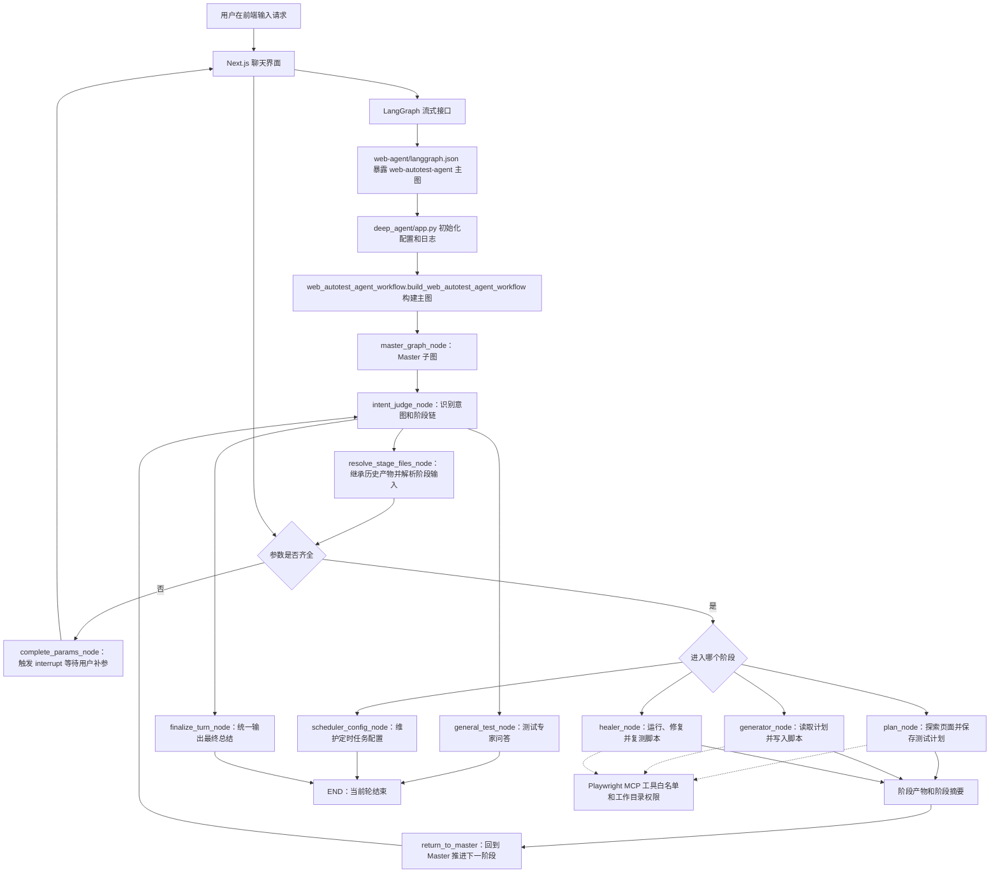

# Web AutoTest Agent 工程说明

## 1. 项目介绍

本项目是一个面向 Web 自动化测试的智能体工程，整体目标是把“理解测试需求、生成测试计划、生成 Playwright 脚本、调试修复失败脚本、定时执行测试”串成可持续使用的闭环。

从整体看，项目由三层组成：

1. 后端智能体层：位于 `web-agent/`，使用 LangGraph 编排主图，通过 Master 子图统一判断意图、补齐参数、分发到具体阶段。
2. 前端交互层：位于 `web-poartl/`，基于 Next.js 和 Agent Chat UI，负责对话、历史线程、文件上传、人工中断补参、工具结果展示。
3. 本地运行与测试层：位于 `test/`、`web-agent/tests/` 和内置 demo 工程，负责一键拉起前后端、验证路由、验证阶段执行和调度服务。

分模块看，后端围绕一个 Master 和四类执行目标组织：

- `master`：统一入口，负责识别用户意图、抽取参数、处理普通问答、决定下一跳。
- `plan`：探索页面并保存 Markdown 测试计划。
- `generator`：读取测试计划并生成 Playwright `.spec.ts` 脚本。
- `healer`：运行失败脚本、定位问题、修改脚本并复测。
- `scheduler`：维护定时任务配置，并可由独立服务按 Cron 扫描执行。

## 2. 目录结构

说明：本节按源码、配置、文档和脚本逐文件标注。`.git/`、`.idea/`、`.venv/`、`.next/`、`node_modules/`、`.uv-cache/`、`__pycache__/`、`.pytest_cache/`、`.langgraph_api/`、运行日志、系统索引文件和 `.env` 本地敏感配置属于本地工具目录、依赖缓存、构建产物、运行产物或私有配置，不作为核心源码逐文件展开。文件名、技术名和配置键保留原文；后面的作用说明使用中文。

```text
web-test-agent/  # 仓库根目录，统一承载后端智能体、前端界面、运行脚本和工程文档。
├── README.md  # 当前工程说明文档，帮助理解项目结构、运行图和核心代码。
├── DEVELOPMENT_GUIDE.md  # 仓库级开发规范，约束目录、提示词、注释、日志和文档同步。
├── PRD-当前实现需求总结.md  # 当前版本产品能力、流程边界和验收口径说明。
├── pyproject.toml  # 根级 Python 工程占位配置，声明仓库级包名和 Python 版本。
├── package-lock.json  # 根级包锁文件，当前主要作为历史或工具链锁定文件保留。
├── .gitignore  # Git 忽略规则，屏蔽依赖、缓存、构建产物、环境文件和运行日志。
├── test/  # 本地联调脚本和前后端运行日志目录。
│   ├── dev.sh  # 一键启动后端 LangGraph 服务和前端 Next.js 服务的联调脚本。
│   ├── debug.md  # 本地调试记录和排查说明。
│   ├── backend.log  # 后端本地运行日志产物，便于查看 LangGraph 与 Agent 执行状态。
│   └── frontend.log  # 前端本地运行日志产物，便于查看 Next.js 启动和编译状态。
├── web-agent/  # 后端智能体工程，包含 LangGraph 图、Agent、MCP 工具、调度服务和测试。
│   ├── langgraph.json  # LangGraph CLI 入口配置，把 `web-autotest-agent` 主图指向 `deep_agent/app.py:agent_graph`。
│   ├── pyproject.toml  # 后端 Python 包配置，声明运行依赖、开发依赖和命令入口。
│   ├── uv.lock  # 后端 Python 依赖锁文件，用于稳定本地依赖版本。
│   ├── package-lock.json  # 后端相关 Node 工具锁文件，主要服务 Playwright MCP 或历史工具链。
│   ├── .env.example  # 后端环境变量模板，配置模型、日志、自动化根目录、调度参数和追踪参数。
│   ├── scheduler_tasks.example.json  # 定时任务示例配置，展示项目、任务、时间表达式和执行位置写法。
│   ├── runtime/  # 后端运行时数据目录，通常为本地产物。
│   │   └── portal/  # 历史或兼容门户运行数据目录。
│   │       └── sessions.json  # 会话运行数据，本地调试时使用。
│   ├── deep_agent/  # 后端核心源码包。
│   │   ├── __init__.py  # 包初始化文件。
│   │   ├── app.py  # LangGraph CLI 加载入口，初始化配置、日志并导出编译后的图对象。
│   │   ├── web_autotest_agent_workflow.py  # Web AutoTest Agent 主工作流定义，集中声明外层节点和主图条件路由。
│   │   ├── agent/  # 所有 Agent、节点、状态和阶段产物逻辑目录。
│   │   │   ├── __init__.py  # Agent 包初始化文件。
│   │   │   ├── state.py  # LangGraph 全局状态字段定义，描述消息、意图、参数、产物和阶段摘要。
│   │   │   ├── base_agent.py  # Agent 抽象基类和 Specialist 通用执行骨架。
│   │   │   ├── artifacts.py  # 阶段产物辅助方法的兼容导出入口。
│   │   │   ├── artifact_helpers/  # 阶段产物、快照、摘要和流水线继承的细分实现。
│   │   │   │   ├── __init__.py  # 产物辅助包初始化文件。
│   │   │   │   ├── common.py  # 产物类型、阶段名、路径校验和通用归一化方法。
│   │   │   │   ├── extractors.py  # 从计划、脚本写入、运行快照中提取结构化阶段产物。
│   │   │   │   ├── manifest.py  # 对工作目录做文件快照并计算前后差异。
│   │   │   │   ├── pipeline.py  # 处理阶段链、阶段游标、历史产物继承和当前轮缓冲清理。
│   │   │   │   └── summaries.py  # 构建 Plan、Generator、Healer 和最终轮次摘要。
│   │   │   ├── specialist_helpers/  # Specialist 公共能力拆分目录。
│   │   │   │   ├── __init__.py  # Specialist 辅助包统一导出入口。
│   │   │   │   ├── types.py  # Specialist 执行上下文和运行配置类型。
│   │   │   │   ├── workspace.py  # 自动化项目目录、文件权限、项目规范和提示词上下文处理。
│   │   │   │   ├── display.py  # 阶段开始消息、可见消息和最终总结展示逻辑。
│   │   │   │   └── logging.py  # 事件流、工具结果、异常和截断日志辅助逻辑。
│   │   │   ├── master/  # Master 子图目录。
│   │   │   │   ├── __init__.py  # Master 包导出入口。
│   │   │   │   ├── master_graph.py  # Master 子图构建入口，集中初始化 Master 节点和子图条件路由。
│   │   │   │   ├── master_agent.py  # Master 共享服务对象，负责模型调用、意图识别、补参、普通问答和最终总结。
│   │   │   │   ├── models/  # Master 结构化输出模型目录。
│   │   │   │   │   ├── __init__.py  # 模型包初始化文件。
│   │   │   │   │   └── intent.py  # 意图识别结构、参数抽取、缺参计算和阶段链推断。
│   │   │   │   ├── nodes/  # Master 子图节点目录。
│   │   │   │   │   ├── __init__.py  # 节点包统一导出入口。
│   │   │   │   │   ├── intent_judge_node.py  # 意图判断节点，负责首次路由和阶段回流后的下一阶段判断。
│   │   │   │   │   ├── resolve_stage_files_node.py  # 阶段文件解析节点，合并显式输入和历史产物。
│   │   │   │   │   ├── complete_params_node.py  # 参数补全节点，缺参时触发 LangGraph 中断并在恢复后继续抽取。
│   │   │   │   │   ├── general_test_node.py  # 普通测试问答节点，处理不进入 Specialist 的问题。
│   │   │   │   │   └── finalize_turn_node.py  # 当前轮最终汇总节点，输出唯一用户可见结论并清理缓冲。
│   │   │   │   └── prompts/  # Master 提示词目录。
│   │   │   │       ├── __init__.py  # 提示词包初始化文件。
│   │   │   │       ├── intent_judge.py  # 意图识别和参数抽取提示词。
│   │   │   │       ├── complete_params.py  # 缺参补全上下文提示词构建逻辑。
│   │   │   │       ├── general_test.py  # 普通测试专家问答提示词。
│   │   │   │       └── summary.py  # 阶段最终回复摘要提示词。
│   │   │   ├── plan/  # Plan 阶段目录。
│   │   │   │   ├── __init__.py  # Plan 包导出入口。
│   │   │   │   ├── plan_agent.py  # Plan 专项智能体，负责页面探索、计划保存和保存成功校验。
│   │   │   │   └── prompts/  # Plan 提示词目录。
│   │   │   │       ├── __init__.py  # 提示词包初始化文件。
│   │   │   │       ├── plan.py  # Plan 主提示词。
│   │   │   │       └── plan_conventions.py  # 移动端或页面规划约定提示词。
│   │   │   ├── generator/  # Generator 阶段目录。
│   │   │   │   ├── __init__.py  # Generator 包导出入口。
│   │   │   │   ├── generator_agent.py  # Generator 专项智能体，负责读取计划并写入测试脚本。
│   │   │   │   ├── runtime.py  # Generator 运行期事件辅助逻辑，用于跟踪写入工具结果和失败状态。
│   │   │   │   └── prompts/  # Generator 提示词目录。
│   │   │   │       ├── __init__.py  # 提示词包初始化文件。
│   │   │   │       ├── generator.py  # Generator 主提示词。
│   │   │   │       └── generator_conventions.py  # 脚本生成业务约定提示词。
│   │   │   ├── healer/  # Healer 阶段目录。
│   │   │   │   ├── __init__.py  # Healer 包导出入口。
│   │   │   │   ├── healer_agent.py  # Healer 专项智能体，负责运行、定位、修复和复测脚本。
│   │   │   │   └── prompts/  # Healer 提示词目录。
│   │   │   │       ├── __init__.py  # 提示词包初始化文件。
│   │   │   │       ├── healer.py  # Healer 主提示词。
│   │   │   │       └── healer_conventions.py  # 修复和移动端界面约定提示词。
│   │   │   └── scheduler/  # Agent 内的定时任务配置阶段目录。
│   │   │       ├── __init__.py  # Scheduler Agent 包导出入口。
│   │   │       └── scheduler_agent.py  # 定时任务配置智能体，负责把用户请求转换为调度配置更新。
│   │   ├── assets/  # 后端内置资源目录。
│   │   │   └── demo/  # 自动化 demo 模板工程，用于目标工程不存在时复制。
│   │   │       ├── README.md  # demo 自动化工程说明。
│   │   │       ├── package.json  # demo 工程依赖和脚本配置。
│   │   │       ├── playwright.config.ts  # demo 工程 Playwright 配置。
│   │   │       └── test_case/  # demo 测试用例目录。
│   │   │           └── shared/  # demo 共享测试基础设施目录。
│   │   │               └── base-test.ts  # demo 测试基类，封装共享 fixture。
│   │   ├── config/  # 后端静态配置目录。
│   │   │   ├── __init__.py  # 配置包初始化文件。
│   │   │   └── specialist_file_filter.py  # Specialist 文件查询范围和过滤规则配置。
│   │   ├── core/  # 后端基础设施目录。
│   │   │   ├── __init__.py  # 基础设施包初始化文件。
│   │   │   ├── config.py  # 环境变量解析、全局配置对象和模型初始化参数构建。
│   │   │   ├── runtime_logging.py  # 统一日志格式、状态摘要、调试事件和敏感信息截断。
│   │   │   ├── autotest_project_directory.py  # 自动化工程目录解析、模板复制和运行时文本归一化。
│   │   │   └── display_message/  # 用户可见消息处理目录。
│   │   │       ├── __init__.py  # 可见消息包统一导出入口。
│   │   │       ├── display_messages.py  # 消息归一化、截断、去重和最终摘要消息构建。
│   │   │       └── visible_runtime_messages.py  # 从事件流中提取可展示消息并构建运行时结果。
│   │   ├── tools/  # MCP 工具接入目录。
│   │   │   ├── __init__.py  # 工具包入口，提供全局 MCP 工具管理器。
│   │   │   ├── mcp_manager.py  # MCP 会话、工具缓存、工具白名单和错误包装的统一管理器。
│   │   │   ├── tool_error_handling.py  # 通用 MCP 工具错误归一化和结构化错误构建。
│   │   │   └── playwright/  # Playwright MCP 专属接入目录。
│   │   │       ├── __init__.py  # Playwright 工具常量和 provider 导出入口。
│   │   │       ├── allowlists.py  # Plan、Generator、Healer 的工具白名单。
│   │   │       ├── mcp_provider.py  # Playwright MCP 连接参数、工作目录准备和错误信息构建。
│   │   │       └── tool_error_policy.py  # Playwright 工具错误是否可重试的策略。
│   │   └── scheduler/  # 独立定时执行服务目录。
│   │       ├── __init__.py  # 调度服务包初始化文件。
│   │       ├── cli.py  # 命令行入口，启动定时扫描服务。
│   │       ├── cron.py  # Cron 表达式解析、字段展开和命中判断。
│   │       ├── models.py  # 定时任务配置的数据模型和字段校验。
│   │       ├── service.py  # 定时任务扫描、排队、冲突处理和 Playwright 执行服务。
│   │       └── store.py  # 定时任务配置文件读写、项目目录和日志路径解析。
│   └── tests/  # 后端自动化测试目录。
│       ├── test_agent_artifacts_compat.py  # 阶段产物兼容导出测试。
│       ├── test_intent_model.py  # 意图模型、缺参规则和阶段链推断测试。
│       ├── test_master_routing.py  # Master 子图路由测试。
│       ├── test_mcp_manager.py  # MCP 管理器和工具筛选测试。
│       ├── test_plan_execution.py  # Plan 阶段执行和保存判定测试。
│       ├── test_runtime_logging.py  # 运行日志格式和截断行为测试。
│       ├── test_scheduler_service.py  # 定时任务服务扫描、排队和执行测试。
│       ├── test_specialist_runtime.py  # Specialist 运行上下文和权限测试。
│       ├── test_visible_runtime_messages.py  # 可见消息提取、合并和过滤测试。
│       └── debug/  # 后端调试脚本和日志辅助目录。
│           ├── DEBUGGING.md  # 后端调试说明。
│           ├── dev.sh  # 后端调试启动脚本。
│           ├── filter_langgraph_log.py  # LangGraph 日志过滤脚本。
│           ├── view_log.sh  # 日志查看辅助脚本。
│           ├── langgraph-dev.log  # LangGraph 调试日志产物。
│           └── web-poartl-dev.log  # 前端调试日志产物。
└── web-poartl/  # 前端聊天界面工程。
    ├── README.md  # 前端子工程说明，记录来源、安装、启动和配置。
    ├── LICENSE  # 前端模板许可证文件。
    ├── package.json  # 前端依赖、脚本和包管理器声明。
    ├── pnpm-lock.yaml  # 前端依赖锁文件。
    ├── next.config.mjs  # Next.js 配置文件。
    ├── tsconfig.json  # TypeScript 编译配置。
    ├── next-env.d.ts  # Next.js 自动生成类型声明入口。
    ├── components.json  # 前端组件体系配置。
    ├── eslint.config.js  # 前端代码检查配置。
    ├── prettier.config.js  # 前端格式化配置。
    ├── postcss.config.mjs  # 样式处理配置。
    ├── tailwind.config.js  # Tailwind 样式配置。
    ├── .env.example  # 前端环境变量模板，配置 LangGraph 地址和图标识。
    ├── .prettierignore  # 前端格式化忽略规则。
    ├── .codespellignore  # 拼写检查忽略规则。
    ├── .dockerignore  # 容器构建忽略规则。
    ├── .gitignore  # 前端 Git 忽略规则。
    ├── .github/  # 前端模板保留的自动化配置目录。
    │   ├── dependabot.yml  # 依赖更新配置。
    │   └── workflows/  # 持续集成配置目录。
    │       └── ci.yml  # 前端检查和构建流程配置。
    └── src/  # 前端源码目录。
        ├── app/  # Next.js 页面和服务端路由目录。
        │   ├── page.tsx  # 页面入口，组合消息、线程、流式上下文和产物面板。
        │   ├── layout.tsx  # 全局页面布局和元数据。
        │   ├── globals.css  # 全局样式和 Tailwind 基础样式。
        │   ├── favicon.ico  # 浏览器图标。
        │   └── api/  # 前端服务端代理路由目录。
        │       └── [..._path]/  # 捕获式代理路径目录。
        │           └── route.ts  # 把前端请求代理到 LangGraph 服务端。
        ├── components/  # 前端组件目录。
        │   ├── icons/  # 图标组件目录。
        │   │   ├── github.tsx  # GitHub 图标组件。
        │   │   └── langgraph.tsx  # LangGraph 图标组件。
        │   ├── ui/  # 基础界面组件目录。
        │   │   ├── avatar.tsx  # 头像组件。
        │   │   ├── button.tsx  # 按钮组件和样式变体。
        │   │   ├── card.tsx  # 卡片组件。
        │   │   ├── input.tsx  # 输入框组件。
        │   │   ├── label.tsx  # 标签组件。
        │   │   ├── password-input.tsx  # 密码输入框组件。
        │   │   ├── separator.tsx  # 分割线组件。
        │   │   ├── sheet.tsx  # 抽屉组件。
        │   │   ├── skeleton.tsx  # 加载骨架组件。
        │   │   ├── sonner.tsx  # 提示消息组件。
        │   │   ├── switch.tsx  # 开关组件。
        │   │   ├── textarea.tsx  # 多行输入组件。
        │   │   └── tooltip.tsx  # 提示浮层组件。
        │   └── thread/  # 对话线程主功能组件目录。
        │       ├── index.tsx  # 聊天主界面，处理提交、补参恢复、消息展示、历史侧栏和文件上传。
        │       ├── message-utils.ts  # 消息类型归一化、流式工具调用合并、可见消息去重和中断读取。
        │       ├── utils.ts  # 消息内容文本提取等基础工具方法。
        │       ├── markdown-text.tsx  # Markdown 渲染组件。
        │       ├── markdown-styles.css  # Markdown 展示样式。
        │       ├── syntax-highlighter.tsx  # 代码高亮组件。
        │       ├── tooltip-icon-button.tsx  # 带提示的图标按钮组件。
        │       ├── ContentBlocksPreview.tsx  # 上传内容块预览组件。
        │       ├── MultimodalPreview.tsx  # 多模态消息预览组件。
        │       ├── artifact.tsx  # 产物面板上下文、标题、内容和开关状态管理。
        │       ├── resume-submit-guard.ts  # 缺参恢复提交去重锁，防止重复提交同一中断。
        │       ├── history/  # 对话历史目录。
        │       │   └── index.tsx  # 历史线程列表、标题提取、状态摘要和切换逻辑。
        │       ├── messages/  # 消息渲染组件目录。
        │       │   ├── ai.tsx  # AI 消息、工具消息、外部组件和中断视图承载组件。
        │       │   ├── human.tsx  # 用户消息展示和编辑组件。
        │       │   ├── generic-interrupt.tsx  # 通用缺参中断展示组件。
        │       │   ├── shared.tsx  # 消息命令栏和分支切换共享组件。
        │       │   └── tool-result.tsx  # 工具结果结构化展示和大内容截断组件。
        │       └── agent-inbox/  # 人工审批中断组件目录。
        │           ├── index.tsx  # 审批中断入口组件。
        │           ├── types.ts  # 审批动作、决策和线程数据类型定义。
        │           ├── utils.ts  # 审批内容格式化、默认回复和决策构造工具。
        │           ├── hooks/  # 审批中断相关钩子目录。
        │           │   └── use-interrupted-actions.tsx  # 从中断数据中提取待审批动作。
        │           └── components/  # 审批中断子组件目录。
        │               ├── inbox-item-input.tsx  # 审批、编辑、拒绝输入组件。
        │               ├── state-view.tsx  # 中断状态树展示组件。
        │               ├── thread-actions-view.tsx  # 待审批动作列表和提交状态组件。
        │               └── thread-id.tsx  # 线程标识复制和提示组件。
        ├── components 2/  # 空目录，疑似本地误生成目录，当前未承载源码文件。
        ├── hooks/  # 前端通用钩子目录。
        │   ├── use-file-upload.tsx  # 文件上传、粘贴、多模态内容块和拖拽处理。
        │   └── useMediaQuery.tsx  # 媒体查询钩子。
        ├── lib/  # 前端工具函数目录。
        │   ├── agent-inbox-interrupt.ts  # 判断中断是否为人工审批结构。
        │   ├── api-key.tsx  # 从浏览器本地存储读取 API Key。
        │   ├── ensure-tool-responses.ts  # 为缺失响应的工具调用补齐占位消息。
        │   ├── multimodal-utils.ts  # 多模态内容块识别工具。
        │   ├── thread-session.ts  # 新建线程意图的浏览器会话状态管理。
        │   ├── thread-title.ts  # 从首条用户请求生成线程标题。
        │   └── utils.ts  # 类名合并等通用工具。
        └── providers/  # 前端上下文提供者目录。
            ├── Thread.tsx  # 线程列表查询和线程状态上下文。
            ├── Stream.tsx  # LangGraph 流式连接、线程恢复、自定义事件和配置表单。
            ├── client.ts  # LangGraph 客户端创建函数。
            └── useStreamContext.ts  # 读取流式上下文的封装钩子。
```

## 3. 运行架构图



运行状态可以按一次用户请求理解为七步：

1. 初始化：`app.py` 读取环境变量、配置日志、调用 `build_web_autotest_agent_workflow()` 编译图。
2. 等待输入：前端通过 `StreamProvider` 连接 `web-autotest-agent` 主图，等待用户提交消息。
3. Master 路由：`IntentJudgeNode` 调用 `MasterAgent` 判断请求属于计划、生成、修复、普通问答或定时任务。
4. 参数准备：`ResolveStageFilesNode` 继承历史产物，`CompleteParamsNode` 在缺参时中断并等待补充。
5. 阶段执行：Plan、Generator、Healer 通过 `BaseSpecialistAgent` 准备工作目录、加载提示词、获取 MCP 工具并执行 Deep Agent。
6. 产物回流：阶段完成后写入 `artifact_history`、`latest_artifacts` 和 `pending_stage_summaries`，多阶段链路继续回到 Master。
7. 汇总结束：`FinalizeTurnNode` 将当前轮所有阶段摘要合成用户可见结论，随后进入下一轮等待。

## 4. 开发与备注规范

- 新增或修改说明性备注、代码注释和 docstring 必须使用中文；技术名、类名、方法名、配置键、文件路径可以保留原文，但解释文字不得写成英文句子。
- 类与方法的备注必须说明三个重点：当前类或方法的作用是什么、主要由谁调用或消费、最终要达成什么目的。
- 文件命名不能只描述“它是什么”，还必须说明“它是谁的什么”；例如使用 `master_graph.py`、`web_autotest_agent_workflow.py` 这类带归属和职责边界的命名，避免 `graph.py`、`workflow.py` 这类缺少区分度的文件名。
- 新增类、节点、Agent、工具、配置字段时，必须同步更新根目录 README、PRD 或开发规范中受影响的部分。
- Pydantic 字段必须写清楚 `description`，说明字段含义、使用场景和影响范围。
- 关键路径必须保留日志，至少覆盖配置加载、图构建、节点入参、节点出参、条件路由、MCP 连接、工具事件和阶段完成状态。
- 提示词文件默认视为业务资产；除非需求明确涉及提示词行为，不应顺手改动无关提示词。

## 5. 核心代码逻辑

### 5.1 后端核心类

- `AppSettings`：集中定义环境变量和运行配置；由 `get_settings()` 创建并被图、Agent、MCP、调度服务复用；目标是把模型、日志、目录和调度参数统一收口。
- `WorkflowState`：描述 LangGraph 状态字段；由所有节点读写；目标是统一承载消息、意图、参数、阶段链、产物和摘要。
- `MasterAgent`：Master 子图共享服务；由意图、补参、普通问答节点调用；核心逻辑是结构化意图识别、补参抽取、历史摘要、普通问答和最终总结。
- `build_web_autotest_agent_workflow`：Web AutoTest Agent 主工作流初始化函数；由 `app.py` 调用；核心逻辑是初始化 Master 子图、Plan、Generator、Healer、Scheduler 和最终汇总节点。
- `build_master_graph`：Master 子图初始化函数；由主图 `build_web_autotest_agent_workflow()` 调用；核心逻辑是初始化 Master 子图节点、注册子图条件边，并返回可嵌入主图的编译子图。
- `IntentClassification`：Master 结构化输出模型；由 `MasterAgent` 的结构化模型调用产出；核心逻辑是约束意图类型、参数字段和路由理由。
- `IntentJudgeNode`：Master 子图入口节点；由 `build_master_graph()` 注册；核心逻辑是首次判断意图、处理阶段回流、推进多阶段链。
- `ResolveStageFilesNode`：阶段输入解析节点；由 Master 子图在进入 Specialist 前调用；核心逻辑是继承历史计划文件、脚本文件和项目目录。
- `CompleteParamsNode`：参数补全节点；由 Master 子图在缺参时调用；核心逻辑是触发 `interrupt`、接收 `resume`、固定原意图继续抽取参数。
- `GeneralTestNode`：普通测试问答节点；由 Master 子图处理非执行类请求时调用；核心逻辑是生成测试专家回答并包装成可见总结。
- `FinalizeTurnNode`：最终汇总节点；由主图在阶段链结束时调用；核心逻辑是合并当前轮阶段摘要、输出最终消息、清理当前轮缓冲。
- `BaseAgent`：所有图节点 Agent 的抽象契约；由 Master 和 Specialist 相关实现遵循；目标是统一 `execute(state, config)` 入口。
- `BaseSpecialistAgent`：Plan、Generator、Healer 的公共执行骨架；由三个专项智能体继承；核心逻辑是参数校验、工作目录准备、MCP 工具获取、提示词拼装、Deep Agent 执行和结果汇总。
- `SpecialistRuntimeConfig`：Specialist 静态运行配置；由各专项智能体声明；核心逻辑是绑定提示词片段、工具白名单、项目规范加载和文件查询过滤规则。
- `SpecialistExecutionContext`：单次 Specialist 执行上下文；由 `BaseSpecialistAgent` 创建；目标是稳定传递工作目录、系统提示词、工具列表和链路追踪上下文。
- `SpecialistWorkspaceMixin`：工作目录和文件权限能力；由 `BaseSpecialistAgent` 混入；核心逻辑是解析项目目录、加载项目规范、构建文件读写权限和运行时上下文。
- `SpecialistDisplayMixin`：用户可见消息能力；由 `BaseSpecialistAgent` 混入；核心逻辑是生成阶段开始消息、阶段总结和前端可展示消息。
- `SpecialistLoggingMixin`：事件流日志能力；由 `BaseSpecialistAgent` 混入；核心逻辑是记录工具事件、异常、截断文本和浏览器关闭类预期异常。
- `PlanAgent`：测试计划阶段智能体；由主图 `plan_node` 调用；核心逻辑是校验工程名和 URL、准备项目目录、初始化页面、监听 `planner_save_plan`、确认计划文件落盘。
- `GeneratorAgent`：脚本生成阶段智能体；由主图 `generator_node` 调用；核心逻辑是解析计划文件或目录、推断预期脚本、监听 `generator_write_test`、沉淀生成产物。
- `GeneratorRuntimeHelper`：Generator 事件辅助类；由 `GeneratorAgent` 使用；核心逻辑是识别写入工具成功或失败、归一化工具输出和错误。
- `HealerAgent`：失败脚本修复阶段智能体；由主图 `healer_node` 调用；核心逻辑是解析脚本文件或目录、限制项目内读写、记录验证运行、提取修复产物。
- `SchedulerAgent`：定时任务配置智能体；由主图 `scheduler_config_node` 调用；核心逻辑是把自然语言定时需求转换成调度配置更新。
- `MCPToolsManager`：MCP 工具统一管理器；由 Specialist 获取工具时调用；核心逻辑是按 server 和工作目录复用会话、筛选工具白名单、缓存工具对象、包装工具错误。
- `MCPServerProvider`：MCP server 接入协议；由 `MCPToolsManager` 消费；目标是让不同 MCP server 自行定义目录归一化、连接参数和连接错误。
- `_CachedToolsSession`：MCP 会话缓存结构；由 `MCPToolsManager` 内部维护；核心逻辑是保存客户端、会话、工具定义和已转换工具。
- `PlaywrightTestMCPProvider`：Playwright MCP 接入实现；由工具管理器调用；核心逻辑是准备工作目录、构建 MCP 启动命令、返回连接失败说明。
- `GenericMCPToolErrorPolicy`：通用工具错误策略；由工具包装逻辑使用；核心逻辑是把异常整理成模型可读的结构化工具错误。
- `PlaywrightMCPToolErrorPolicy`：Playwright 工具错误策略；由 Playwright provider 使用；核心逻辑是区分可重试错误和不可重试错误。
- `SchedulerService`：独立定时执行服务；由命令行入口启动；核心逻辑是扫描配置、计算到点任务、串行排队、处理冲突、启动 Playwright 测试。
- `PendingScheduledRun`：单次待执行任务请求；由调度服务创建；核心逻辑是封装项目、任务、时间、路径和日志位置。
- `ScheduledRunResult`：单次定时任务结果；由任务执行器返回；核心逻辑是记录退出码和耗时。
- `PlaywrightTaskRunner`：默认定时任务执行器；由 `SchedulerService` 调用；核心逻辑是在目标项目中执行 `npx playwright test` 并写入项目日志。
- `CronExpression` 与 `CronField`：Cron 解析模型；由调度服务判断任务是否到点；核心逻辑是解析字段、展开范围、匹配当前分钟。
- `SchedulerRuntimeConfig`、`ScheduledTaskConfig`、`ScheduledProjectConfig`、`SchedulerConfigFile`：调度配置模型；由配置读写和服务扫描使用；核心逻辑是校验任务字段、归一化路径列表和保存配置结构。

### 5.2 前端核心组件与函数

- `ThreadProvider`：线程列表上下文；由页面入口包裹；核心逻辑是按 graph 或 assistant 查询历史线程。
- `StreamProvider`：流式连接上下文；由页面入口包裹；核心逻辑是读取连接配置、检查后端状态、创建 LangGraph 流、处理自定义可见消息事件。
- `StreamSession`：单次流式会话组件；由 `StreamProvider` 使用；核心逻辑是恢复历史线程、处理线程失效、合并 `display_messages` 事件。
- `Thread`：聊天主界面组件；由首页渲染；核心逻辑是提交新消息、处理缺参恢复、展示消息列表、历史侧栏、文件上传和产物面板。
- `AssistantMessage`：AI 和工具消息渲染组件；由 `Thread` 调用；核心逻辑是展示 Markdown、工具结果、人工中断和命令栏。
- `HumanMessage`：用户消息渲染组件；由 `Thread` 调用；核心逻辑是展示用户输入和多模态内容。
- `ToolResult`：工具结果展示组件；由 `AssistantMessage` 调用；核心逻辑是解析 JSON、截断大内容、展示紧凑可读结果。
- `GenericInterruptView`：通用补参中断展示组件；由 `AssistantMessage` 调用；核心逻辑是展示问题和中断状态，等待用户恢复。
- `ThreadView`：人工审批中断入口组件；由 `AssistantMessage` 调用；核心逻辑是展示待审批动作并收集批准、编辑或拒绝结果。
- `ThreadHistory`：历史线程列表组件；由 `Thread` 侧栏调用；核心逻辑是提取标题、展示状态、切换线程。
- `ArtifactProvider` 与相关钩子：产物面板状态组件；由页面入口包裹；核心逻辑是管理右侧产物面板内容和开关状态。
- `useFileUpload`：文件上传钩子；由 `Thread` 使用；核心逻辑是处理选择、拖拽、粘贴和内容块预览。
- `mergeVisibleMessages`：可见消息合并函数；由前端流式层和主界面使用；核心逻辑是把持久消息、实时消息和自定义展示消息去重合并。
- `buildResumeSubmitKey`、`tryLockResumeSubmit`、`unlockResumeSubmit`：补参提交保护函数；由 `Thread` 使用；核心逻辑是防止同一中断重复提交。
