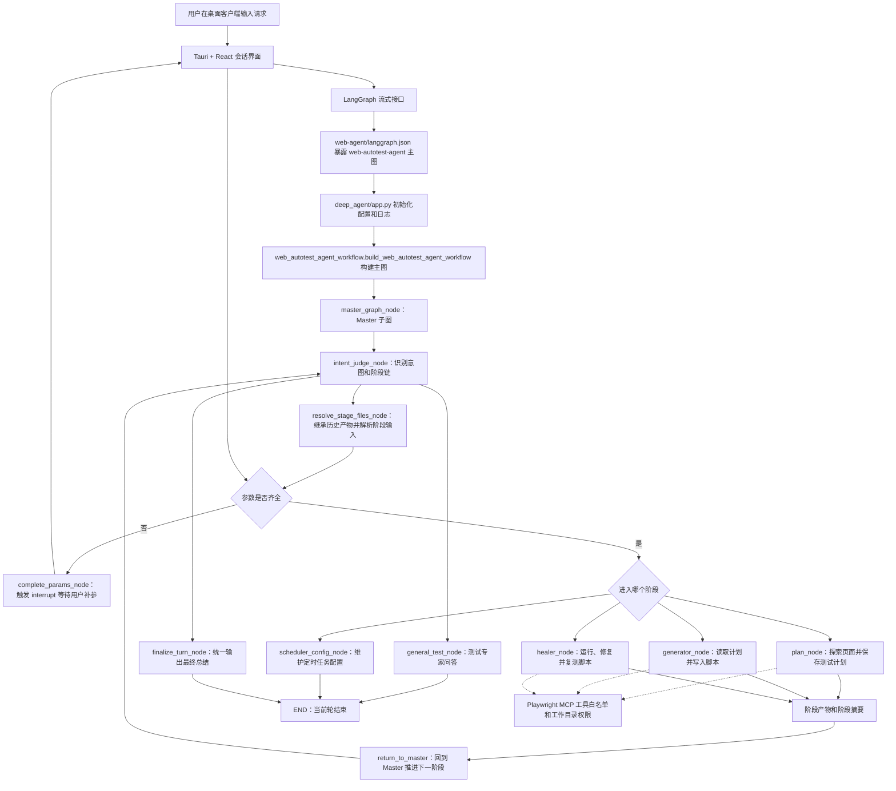

# Web AutoTest Agent 工程说明

## 1. 项目介绍

本项目是一个面向 Web 自动化测试的智能体工程，整体目标是把"理解测试需求、生成测试计划、生成 Playwright 脚本、调试修复失败脚本、定时执行测试"串成可持续使用的闭环。

从整体看，项目由三层组成：

1. 后端智能体层：位于 `web-agent/`，使用 LangGraph 编排主图，通过 Master 子图统一判断意图、补齐参数、分发到具体阶段。
2. 桌面客户端层：位于 `web-agent-client/`，基于 Tauri v2、React 和 Vite，负责对话、历史线程、人工中断补参、工具结果展示及本地后端生命周期管理。
3. 本地运行与测试层：位于 `start/`、`web-agent/tests/` 和内置 demo 工程，负责拉起后端、验证路由、验证阶段执行和调度服务。

分模块看，后端围绕一个 Master 和四类执行目标组织：

- `master`：统一入口，负责识别用户意图、抽取参数、处理普通问答、决定下一跳。
- `plan`：探索页面并保存 Markdown 测试计划。
- `generator`：读取测试计划并生成 Playwright `.spec.ts` 脚本。
- `healer`：运行失败脚本、定位问题、修改脚本并复测。
- `scheduler`：维护定时任务配置，并可由独立服务按 Cron 扫描执行。

## 2. 桌面客户端能力

### 2.1 快捷任务模板

新对话提供四个单行排列的快捷入口，按钮只显示标题，点击后把完整模板填入输入框，用户补齐 `{...}` 占位参数后即可提交：

- `plan+generator+healer`：在同一轮按 Plan -> Generator -> Healer 顺序连续执行，阶段间自动继承产物。
- `独立 Plan`：探索真实页面并保存 Markdown 测试计划。
- `独立 Generator`：读取指定或本对话最近生成的 Markdown，为目标用例生成 Playwright 脚本。
- `独立 Healer`：只运行、修复并复测指定范围内的失败脚本。

四个入口保持一行展示；输入框会随内容增高，超过五行后在内部滚动。

### 2.2 后端日志主题

“后端日志”窗口会解析 ANSI 控制符并显示日志级别、模块名等原始颜色，不再把转义序列当作乱码。主题可切换为 `macOS 控制台`、`深色` 或 `浅色`，选择结果会保存在本机。

### 2.3 历史会话续聊

点击历史会话后可以继续发送消息。后端会在再次调用模型前修复持久化工具消息链：忽略没有对应调用的孤立工具结果，并为未闭合的工具调用补齐结果，避免 OpenAI `function_call_output` 协议错误。

## 3. 目录结构

说明：本节重点展开服务端目录、核心类和入口函数。桌面客户端的详细结构见其子工程 README；本地缓存、运行日志、运行时数据、测试缓存、依赖目录和构建产物不在这里说明。

```text
web-test-agent/  # 仓库根目录。
├── README.md  # 当前工程说明文档。
├── DEVELOPMENT_GUIDE.md  # 开发规范和协作约束。
├── doc/  # 产品需求文档。
│   └── PRD-当前实现需求总结.md  # 当前版本需求与能力边界说明。
├── .github/  # GitHub 自动化配置。
│   └── workflows/
│       └── ci.yml  # 持续集成流程。
├── start/  # 启动根目录，平台脚本直接放在这里。
│   ├── macos-start.command  # macOS 一键启动客户端和后端，支持 start / end / logs。
│   ├── windows-start.ps1  # Windows 一键启动客户端和后端，支持 start / end / logs。
│   └── build-windows-x64-portable.ps1  # Windows x64 便携包构建脚本。
├── web-agent/  # 后端智能体工程。
│   ├── pyproject.toml  # Python 包配置与命令入口。
│   ├── uv.lock  # Python 依赖锁文件。
│   ├── langgraph.json  # LangGraph 主图入口配置。
│   ├── scheduler_tasks.example.json  # 定时任务配置示例。
│   ├── deep_agent/  # 后端核心源码包。
│   │   ├── app.py  # LangGraph 加载入口，导出 `agent_graph`。
│   │   ├── web_autotest_agent_workflow.py  # 主工作流定义，提供 `build_web_autotest_agent_workflow()`。
│   │   ├── helpers/  # 跨 Agent 的公共辅助能力，不承载节点编排。
│   │   │   ├── artifacts.py  # 阶段产物、工作区快照、阶段摘要等公共导出。
│   │   │   ├── artifact_helpers/  # 产物提取、manifest、阶段链和摘要实现。
│   │   │   └── specialist_helpers/  # Specialist 公共辅助能力。
│   │   │       ├── types.py  # `SpecialistRuntimeConfig` 与 `SpecialistExecutionContext`。
│   │   │       ├── workspace.py  # `SpecialistWorkspaceMixin`，处理项目目录和文件权限。
│   │   │       ├── display.py  # `SpecialistDisplayMixin`，处理阶段展示消息和总结。
│   │   │       ├── logging.py  # `SpecialistLoggingMixin`，处理事件日志和异常截断。
│   │   │       ├── input_resolution.py  # Specialist 输入归一化与 workspace 边界校验（通用入口）。
│   │   │       └── browser_close.py  # 统一识别 Playwright 浏览器关闭后的预期异常。
│   │   ├── agent/  # Master、Plan、Generator、Healer、Scheduler 等智能体实现。
│   │   │   ├── state.py  # `WorkflowState`，统一承载消息、意图、参数、阶段链和产物。
│   │   │   ├── base_agent.py  # `BaseAgent` 与 `BaseSpecialistAgent`，定义节点执行契约和 Specialist 公共骨架。
│   │   │   ├── finalizer/  # 主工作流最终汇总节点。
│   │   │   ├── master/  # Master 子图与共享服务。
│   │   │   │   ├── master_graph.py  # `build_master_graph()`，构建 Master 子图。
│   │   │   │   ├── master_agent.py  # `MasterAgent`，负责意图识别、补参、问答和最终总结。
│   │   │   │   ├── models/
│   │   │   │   │   └── intent.py  # `IntentClassification` 与参数抽取、缺参计算、阶段链推断。
│   │   │   │   └── nodes/
│   │   │   │       ├── intent_judge_node.py  # `IntentJudgeNode`，负责首次路由和阶段推进。
│   │   │   │       ├── resolve_stage_files_node.py  # `ResolveStageFilesNode`，继承历史产物并解析阶段文件。
│   │   │   │       ├── complete_params_node.py  # `CompleteParamsNode`，缺参中断与恢复。
│   │   │   │       └── general_test_node.py  # `GeneralTestNode`,处理普通测试问答。
│   │   │   ├── plan/
│   │   │   │   ├── plan_agent.py  # `PlanAgent`，阶段入口，只承担配置、参数校验、workspace、prompt、权限。
│   │   │   │   └── runtime.py  # `PlanRuntimeHelper`，承担事件流监听、`planner_save_plan` 状态机和产物抽取。
│   │   │   ├── generator/
│   │   │   │   ├── generator_agent.py  # `GeneratorAgent`，阶段入口，只承担配置、参数校验、workspace、prompt、权限。
│   │   │   │   └── runtime.py  # `GeneratorRuntimeHelper`，承担事件流监听、写文件状态机和脚本落盘校验。
│   │   │   ├── healer/
│   │   │   │   ├── healer_agent.py  # `HealerAgent`，阶段入口，只承担配置、参数校验、workspace、prompt、权限。
│   │   │   │   └── runtime.py  # `HealerRuntimeHelper`，承担事件流监听、验证范围采集和调试产物抽取。
│   │   │   └── scheduler/
│   │   │       └── scheduler_agent.py  # `SchedulerAgent`，把自然语言定时需求转成调度配置更新。
│   │   ├── config/  # 静态配置和文件过滤规则。
│   │   │   └── specialist_file_filter.py  # Specialist 文件查询范围和过滤规则。
│   │   ├── core/  # 基础设施、配置解析和显示消息逻辑。
│   │   │   ├── config.py  # `AppSettings` 与 `get_settings()`，集中管理环境变量和运行配置。
│   │   │   ├── autotest_project_directory.py  # 自动化工程目录解析与内置 demo 模板复制。
│   │   │   ├── cancellation.py  # LangGraph 用户取消信号识别。
│   │   │   ├── local_runtime_cleanup.py  # 本地 in-memory runtime 启动清理。
│   │   │   ├── runtime_logging.py  # 统一日志格式、状态摘要和敏感信息截断。
│   │   │   ├── model_message_history.py  # 修复发给模型的工具调用与工具结果消息链。
│   │   │   └── display_message/  # 用户可见消息提取、去重和汇总逻辑。
│   │   ├── scheduler/  # 独立定时执行服务。
│   │   │   ├── cli.py  # 定时服务命令行入口。
│   │   │   ├── cron.py  # `CronField` 与 `CronExpression`，解析和匹配 Cron 表达式。
│   │   │   ├── models.py  # `SchedulerRuntimeConfig` 等调度配置模型。
│   │   │   ├── service.py  # `PendingScheduledRun`、`ScheduledRunResult`、`PlaywrightTaskRunner`、`SchedulerService`。
│   │   │   └── store.py  # 调度配置文件读写与项目路径解析。
│   │   ├── tools/  # MCP 与 Playwright 工具接入。
│   │   │   ├── mcp_manager.py  # `MCPServerProvider`、`_CachedToolsSession`、`MCPToolsManager`（通用编排，无业务特例）。
│   │   │   ├── tool_error_handling.py  # `GenericMCPToolErrorPolicy`，统一工具错误包装。
│   │   │   ├── tool_invocation.py  # 工具输出判错、直接调用底层实现等通用辅助。
│   │   │   └── playwright/
│   │   │       ├── mcp_provider.py  # `PlaywrightTestMCPProvider`，连接参数与 `post_process_tool` 钩子。
│   │   │       ├── planner_save_plan_wrapper.py  # `planner_save_plan` 阶段专属规则包装（路径校验、缺父目录重建）。
│   │   │       ├── allowlists.py  # Plan / Generator / Healer 各自允许调用的工具白名单。
│   │   │       └── tool_error_policy.py  # `PlaywrightMCPToolErrorPolicy`，区分可重试和不可重试错误。
│   │   └── assets/  # 内置 demo 模板与资源文件。
│   └── tests/  # 后端自动化测试与调试脚本。
└── web-agent-client/  # Tauri v2 桌面客户端，支持 macOS 和 Windows。
    ├── src/  # React 会话、历史、工具消息和任务取消界面。
    ├── src-tauri/  # 原生窗口、HTTP 权限和后端进程生命周期管理。
    └── README.md  # 开发、构建和运行说明。
```

### 3.1 服务端核心类与职责

- 入口与状态：`AppSettings` 负责统一环境变量和运行配置，`WorkflowState` 负责统一 LangGraph 全局状态，`build_web_autotest_agent_workflow()` 负责组装整个服务端主图。
- Master 路由层：`MasterAgent`、`IntentClassification`、`IntentJudgeNode`、`ResolveStageFilesNode` 和 `CompleteParamsNode` 共同完成意图识别、缺参补全和阶段切换；`FinalizeTurnNode` 位于 `agent/finalizer/`，由主工作流在多阶段完成后统一合并最终回复。
- Specialist 执行层：`BaseAgent` 定义统一执行接口，`BaseSpecialistAgent` 负责 Plan、Generator、Healer 三类阶段的公共执行骨架；`SpecialistRuntimeConfig`、`SpecialistExecutionContext` 和三个 `Mixin`（workspace、display、logging）负责运行时配置、目录权限、消息展示和日志处理。
- Specialist 分层约定：`*_agent.py` 只承担"阶段配置 + 参数校验 + workspace 解析 + prompt + 写权限"这类静态职责；事件流监听、工具状态机、产物抽取等运行期逻辑放在同目录下的 `runtime.py`（`PlanRuntimeHelper` / `GeneratorRuntimeHelper` / `HealerRuntimeHelper`）里，分层方式与 Master 的 `master_agent.py + master_graph.py + nodes/*.py` 保持一致。
- 通用输入与异常识别：Specialist 规范化的输入解析、workspace 边界校验、浏览器关闭预期异常识别等能力统一放在 `helpers/specialist_helpers/` 下的 `input_resolution.py` 与 `browser_close.py`，不再在各阶段重复实现。
- 阶段智能体：`PlanAgent` 负责生成测试计划，`GeneratorAgent` 负责生成脚本，`HealerAgent` 负责修复失败脚本，`SchedulerAgent` 负责把自然语言定时需求转换为配置更新。
- 工具与调度层：`MCPToolsManager` 只做通用编排（会话复用、白名单解析、错误处理器补齐），`MCPServerProvider.post_process_tool` 钩子承担各 server 的业务规则，例如 Playwright 的 `planner_save_plan` 路径校验与缺父目录自动重建（见 `tools/playwright/planner_save_plan_wrapper.py`）；`SchedulerService`、`PlaywrightTaskRunner`、`PendingScheduledRun`、`ScheduledRunResult` 负责定时任务的扫描、排队和执行；`CronExpression` 与 `CronField` 负责 Cron 解析与命中判断。

## 4. 运行架构图



运行状态可以按一次用户请求理解为七步：

1. 初始化：`app.py` 读取环境变量、配置日志、调用 `build_web_autotest_agent_workflow()` 编译图。
2. 等待输入：桌面客户端通过 LangGraph 流式接口连接 `web-autotest-agent` 主图，等待用户提交消息。
3. Master 路由：`IntentJudgeNode` 调用 `MasterAgent` 判断请求属于计划、生成、修复、普通问答或定时任务。
4. 参数准备：`ResolveStageFilesNode` 继承历史产物，`CompleteParamsNode` 在缺参时中断并等待补充。
5. 阶段执行：Plan、Generator、Healer 通过 `BaseSpecialistAgent` 准备工作目录、加载提示词、获取 MCP 工具并执行 Deep Agent。
6. 产物回流：阶段完成后写入 `artifact_history`、`latest_artifacts` 和 `pending_stage_summaries`，多阶段链路继续回到 Master。
7. 汇总结束：`FinalizeTurnNode` 将当前轮所有阶段摘要合成用户可见结论，随后进入下一轮等待。
